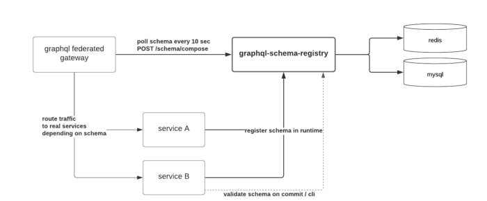

# gateway

[](https://gitlab.slade360emr.com/go/gateway/-/commits/develop)
[](https://gitlab.slade360emr.com/go/gateway/-/commits/develop)

An Apollo GraphQL Gateway that is used to implement federated GraphQL micro-services.

For more context, see https://www.apollographql.com/docs/apollo-server/federation/introduction/
and https://gqlgen.com/recipes/federation/ .

# How It Works



The gateway polls the schema registry every <n> seconds which is specified as a `POLLING_INTERVAL`.
The gateway takes federated services from schema registry and asks the schema
registry to compose. For this work it also means that `POLLING_ENABLED` should be enabled as an environment variable.

### Local development setup

- Ensure the schema registry(https://gitlab.slade360emr.com/go/schema-registry) is running.
- Push a schema to the registry and ensure the service that owns it is running.
- run `npm start`
- navigate to http://localhost:<PORT>/graphql

## Configuration

The service is configured via environment variables.

For local development, the environment variables are configured locally e.g in an `env.sh`
files:

```env
PORT=8000
DEBUG=true
GOOGLE_APPLICATION_CREDENTIALS="<a valid path to a service account JSON file>"
APQ_ENABLED=false
SUBSCRIPTIONS_ENABLED=false
INTROSPECTION_ENABLED=true
PLAYGROUND_ENABLED=true
POLLING_INTERVAL=300000
SCHEMA_REGISTRY_URL="https://test.schemaregistry.bewell.co.ke/"
POLLING_ENABLED=true
LOGIN_SERVICE_URL=https://profile-testing.healthcloud.co.ke/login_anonymous
LOGIN_SERVICE_FLAVOUR="CONSUMER"
```

The `LOGIN_SERVIVE_URL` should point to where you want to login. There are
three environments where a login is possible, _staging_, _testing_ and _prod_

For staging:

```env
LOGIN_SERVICE_URL=https://login-staging.healthcloud.co.ke/login
```

For testing:

```env
LOGIN_SERVICE_URL=https://login-multitenant.healthcloud.co.ke
```

or

```env

LOGIN_SERVICE_URL=https://login-core.healthcloud.co.ke
```

or

```env
LOGIN_SERVICE_URL=https://login-prod.healthcloud.co.ke  # despite the name
```

For Prod:

```env
LOGIN_SERVICE_URL=https://login-core-release.healthcloud.co.ke
```

Obviously it is expected that the user you are trying to login with exists in the respective auth server. If not, you have the honor of creating them.

REMINDER:
testing, prod and staging endpoint are hosted under `bewell-app` glcoud projects.

For production deployment, the environment variables are configured via the `playbooks/group_vars`
YAML configuration files.

The `PORT` environment variable is set automatically on the cloud container
runtimes. In the playbooks, this corresponds to the `port` group variable.

`DEBUG` should be set to `true` when you want detailed logging. It defaults to
`false`. In the playboks, this corresponds to the `debug` group variable.

`GOOGLE_APPLICATION_CREDENTIALS` should be set to the path of a service account
file when running locally. The default is blank; it should be left blank when
running on Google Cloud. This is **not** set in the playbooks - our gateways run on
Google Compute Engine with application default credentials.

`APQ_ENABLED` is used to enable the GraphQL automatically persisted query cache.
It should _only be set to `true` when APQ is enabled on all downstream services_.
It's a policy decision - do we want APQ or not? The default is `false`. In the playbooks,
this corresponds to the `apq_enabled` group variable.

`SUBSCRIPTIONS_ENABLED` is used to turn GraphQL subscriptions on/off. It defaults
to `false`. Before you turn it on, you need to make sure that your downstream
services support long lived subscriptions. In the playbooks, this corresponds to the
`subscriptions_enabled` group variable.

`INTROSPECTION_ENABLED` determines whether introspection will be enabled on
production or not. It is safer to disable it (enable for test services). In the playbooks,
this corresponds to the `introspection_enabled` group variable.

`PLAYGROUND_ENABLED` determines whether to enable the GraphQL IDE on production
or not. It is safer to disable it (enable for test services). In the playbooks,
this corresponds to the `playground_enabled` group variable.

`NODE_ENV` should be set to `development` on developer machines and to `production`
on the server. In the playbooks, this corresponds to the `node_env` group variable.

`LOGIN_SERVICE_URL` should be the URL to the login endpoint for a Be.Well login
service. In the playbooks, this corresponds to the `login_service_url` group variable.

`LOGIN_SERVICE_FLAVOUR` should be valid.
In the playbooks, this corresponds to `login_service_flavour` group variable.

```

```
